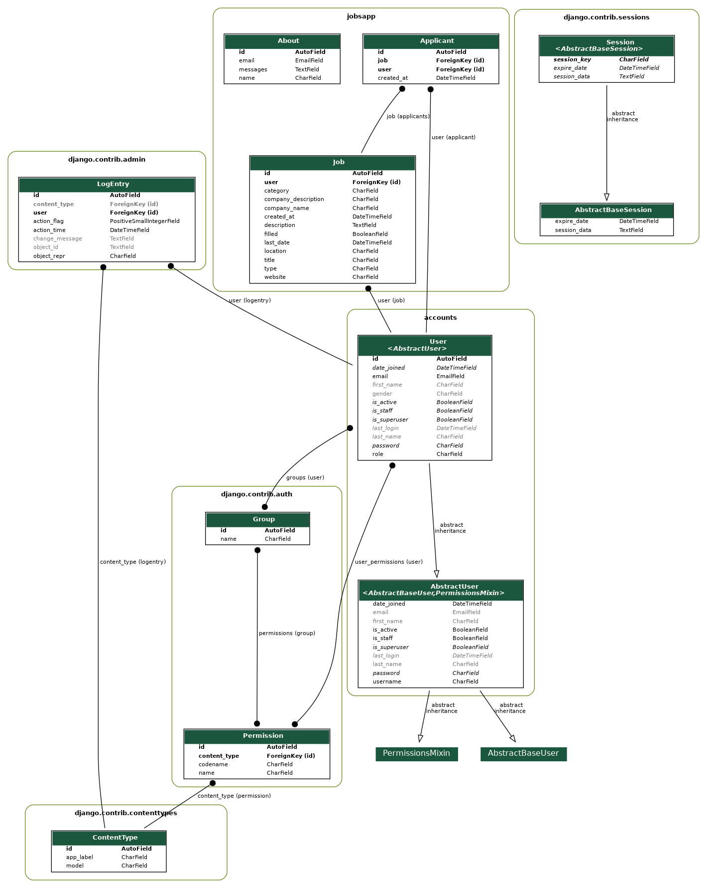

# Practice Portal

**Веб-портал для пошуку місця проходження студентської практики / A web portal for finding student internship placements.**

---

## 📌 About

Practice Portal is a Django-based web application that connects students with companies offering internship opportunities. Students can browse and apply for available positions, while employers can post and manage internship listings.

The project includes user account management, a job listings app, PDF report generation, and QR code support.

---

## ✨ Features

- 🔍 Browse and search available internship/practice positions
- 📝 Student and employer account registration & authentication
- 📄 PDF report generation (via `reportlab` + `xhtml2pdf`)
- 📊 Data visualization with `matplotlib`
- 🔲 QR code generation for listings
- 🗄️ SQLite database (easily swappable to PostgreSQL)
- 🚀 Production-ready with `gunicorn` + `whitenoise` for static files

---

## 🛠️ Tech Stack

| Layer | Technology |
|---|---|
| Backend | Python, Django 2.1 |
| Frontend | HTML, CSS, JavaScript, Django Templates |
| Forms | django-crispy-forms |
| PDF | reportlab, xhtml2pdf, PyPDF2 |
| Charts | matplotlib, numpy |
| QR Codes | qrcode, Pillow |
| Static files | whitenoise |
| Server | gunicorn |
| Database | SQLite (default) |

---

## 🗂️ Project Structure

```
practice-portal/
├── accounts/        # User authentication & profiles
├── jobsapp/         # Internship listings & applications
├── practice/        # Django project settings
├── templates/       # HTML templates
├── static/          # CSS, JS, images
├── screenshots/     # App screenshots
├── manage.py
├── requirements.txt
├── Procfile         # For Heroku / process managers
└── db.sqlite3
```

---

## 🚀 Getting Started

### Prerequisites

- Python 3.6+
- pip

### 1. Clone the repository

```bash
git clone https://github.com/snowbhub/practice-portal.git
cd practice-portal
```

### 2. Create a virtual environment

```bash
python -m venv venv
source venv/bin/activate      # Linux / macOS
venv\Scripts\activate         # Windows
```

### 3. Install dependencies

```bash
pip install -r requirements.txt
```

### 4. Apply migrations

```bash
python manage.py migrate
```

### 5. Create a superuser

```bash
python manage.py createsuperuser
```

### 6. Run the development server

```bash
python manage.py runserver
```

Open [http://127.0.0.1:8000](http://127.0.0.1:8000) in your browser.

---

## 🌐 Deployment

The project includes a `Procfile` for deployment via Heroku or any process manager:

```
web: gunicorn practice.wsgi
```

Static files are served in production via **whitenoise** — no separate static server required.

---

## 🗃️ Database Schema

An ER diagram is included in the repository:



---

## 👤 Author

**Dmytro Shapovaliuk**  
[LinkedIn →](https://www.linkedin.com/in/dmytro-shapovaliuk-4aab80394/)

---

## 📄 License

This project is open source and available for portfolio and educational purposes.
